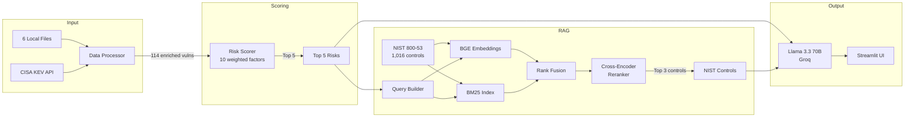
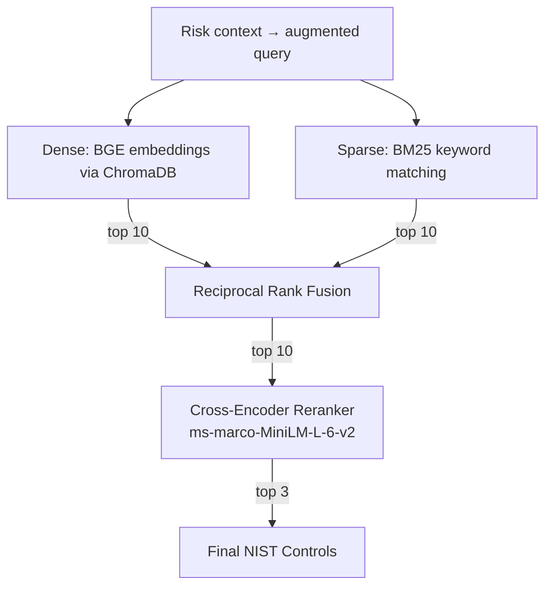

# TawasolPay — AI Cyber Risk Assistant

> Multi-factor risk scoring + RAG-based NIST 800-53 remediation for TawasolPay's infrastructure.

**Live App:** [cyber-risk-assistant.streamlit.app](https://cyber-risk-assistant-nszp7eqkganw7nasvhs558.streamlit.app/)

---

## Quick Start

```bash
git clone https://github.com/Yashraj0906/cyber-risk-assistant.git
cd cyber-risk-assistant
python -m venv venv
venv\Scripts\activate          # Windows
pip install -r requirements.txt

# Add your Groq API key
cp .env.example .env           # then edit .env

streamlit run app.py
```

---

## What It Does

1. **Ingests** 6 CSV/markdown files + CISA KEV (live API) + NIST SP 800-53 (1,016 controls)
2. **Scores** all 114 vulnerabilities using 10 weighted factors (not just CVSS)
3. **Retrieves** relevant NIST controls via hybrid RAG (dense + sparse + reranking)
4. **Generates** plain-English risk explanations and remediation steps via LLM

---

## Architecture



---

## Risk Scoring

CVSS alone doesn't capture real-world risk. A CVSS-10 on an internal dev box is less dangerous than a CVSS-8 on an internet-facing VPN with active ransomware campaigns.

| Factor | Points | Source |
|--------|--------|--------|
| Internet-exposed | 25 | assets.csv |
| Exploit weaponized | 20 | vulnerabilities + threat_intel |
| CISA KEV confirmed | 15 | CISA KEV API |
| Ransomware linked | 15 | threat_intel + KEV |
| Business criticality | 4-10 | business_services.csv |
| Compliance scope | 5 | business_services.csv |
| No EDR | 5 | assets.csv |
| Production env | 3 | assets.csv |
| CVSS (normalized) | 0-5 | vulnerabilities.csv |
| Customer-facing | 2 | business_services.csv |

---

## RAG Pipeline



- **Dense** catches semantic similarity ("patching" ↔ "flaw remediation")
- **Sparse** catches exact terms ("AC-17" ↔ "AC-17 Remote Access")
- **RRF** merges rank lists without needing score calibration
- **Cross-encoder** re-scores each (query, doc) pair for precise final ranking

---

## Evaluation

| Metric | Score |
|--------|-------|
| Hit Rate @3 | 1.0 |
| MRR | 0.9 |
| Context Precision | 1.0 |
| Pytest (12 tests) | All passed |

---

## Tech Stack

| Component | Choice |
|-----------|--------|
| LLM | Llama 3.3 70B (Groq free tier) |
| Embeddings | BAAI/bge-small-en-v1.5 |
| Reranker | cross-encoder/ms-marco-MiniLM-L-6-v2 |
| Sparse | BM25 (rank-bm25) |
| Vector DB | ChromaDB (persistent, local) |
| UI | Streamlit |

---

## Project Structure

```
├── app.py                  # Streamlit web interface
├── src/
│   ├── data_loader.py      # Load CSVs + fetch CISA KEV & NIST
│   ├── data_processor.py   # Join all sources → enriched DataFrame
│   ├── risk_scorer.py      # 10-factor scoring engine
│   ├── chunker.py          # NIST controls → embedding chunks
│   ├── embeddings.py       # BGE embedding model
│   ├── vector_store.py     # ChromaDB indexing & search
│   ├── sparse_retriever.py # BM25 keyword search
│   ├── rag_pipeline.py     # Hybrid retrieval orchestrator
│   ├── llm_client.py       # Groq API client
│   ├── output_generator.py # LLM prompt engineering
│   └── rag_evaluator.py    # Retrieval evaluation metrics
├── data/                   # TawasolPay CSVs + threat report
├── eval/                   # Golden test set + evaluation results
└── tests/                  # 12 automated tests
```

---

## Supporting Questions

### 1. The Data Split

**Embedded:** NIST SP 800-53 controls (1,016 documents). These are unstructured prose — security control descriptions and implementation guidance. Semantic search is the right tool because a query about "VPN remote code execution" needs to match controls named "Flaw Remediation" or "Remote Access" — connections that keyword matching alone would miss.

**Queried as structured records:** The CSVs (assets, vulnerabilities, threat intel, business services) and CISA KEV. These have clear column relationships (asset_id, CVE, business_service) that are best handled by pandas joins and filters. Embedding a CSV row would lose the structured field-level relationships.

### 2. Where It Goes Wrong

1. **Missing KEV coverage:** If a CVE is actively exploited but not yet in the CISA KEV catalog, the system scores it 15 points lower than it should. Fix: supplement with EPSS (Exploit Prediction Scoring System) as a secondary signal for exploitation likelihood.

2. **Single threat actor per CVE:** The data processor deduplicates threat intel by CVE, keeping only the highest-confidence match. If CVE-2024-21762 is exploited by both a ransomware gang and a state-sponsored APT, only one is retained. Fix: aggregate all threat actors per CVE and take the maximum risk signal from each.

3. **Control family mismatch:** The retriever can return controls from the correct NIST family but wrong sub-control. For example, querying about "VPN authentication bypass" might return IA-2(13) "Out-of-band Authentication" instead of IA-2(1) "Multi-Factor Authentication to Privileged Accounts." Fix: add asset-type metadata filtering before reranking.

### 3. One Thing I Would Change

I would replace the hand-tuned scoring weights with a learned model. The current weights (internet_exposed = 25, exploit = 20, etc.) are based on industry heuristics and work for TawasolPay's data, but they're static. Given another day, I'd train a lightweight XGBoost model on historical breach data using "was this vulnerability actually exploited?" as the target — so the weights reflect real-world outcomes, not manual judgment.
