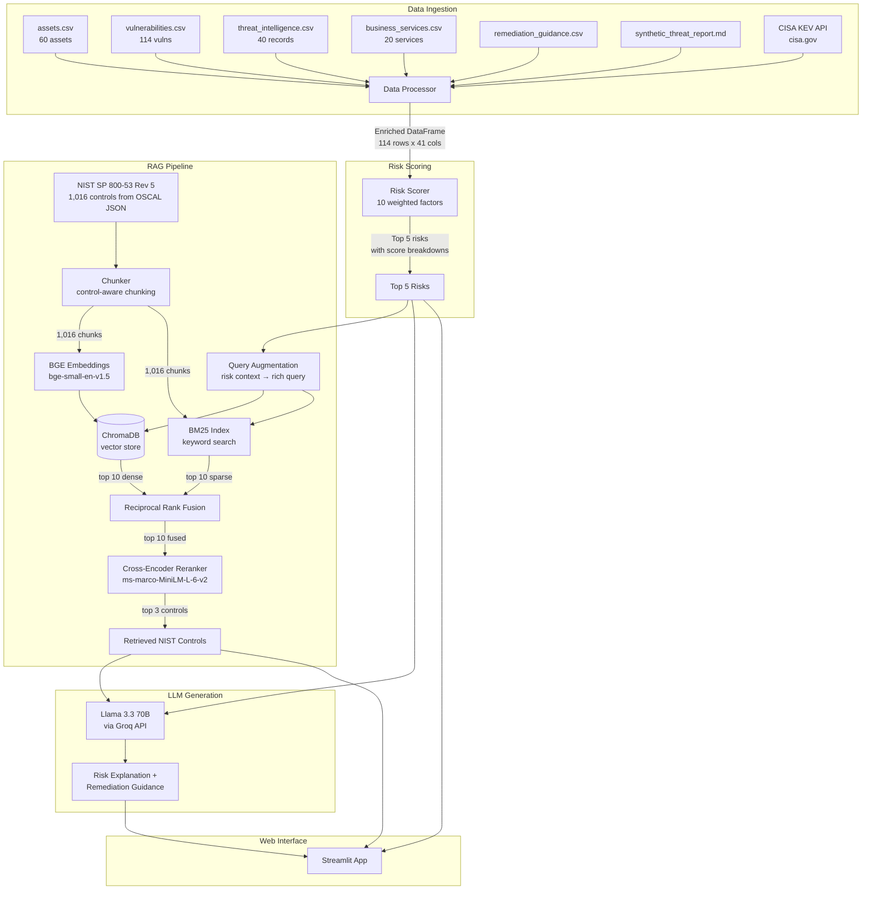
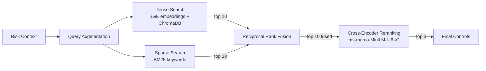

# TawasolPay — AI-Powered Cyber Risk Assessment

**Live Demo:** [cyber-risk-assistant.streamlit.app](https://cyber-risk-assistant-nszp7eqkganw7nasvhs558.streamlit.app/)  
**Repository:** [github.com/Yashraj0906/cyber-risk-assistant](https://github.com/Yashraj0906/cyber-risk-assistant)

An AI-powered system that ingests TawasolPay's cybersecurity data, scores vulnerabilities using multi-factor risk analysis (not just CVSS), retrieves relevant NIST SP 800-53 controls via a hybrid RAG pipeline, and generates actionable remediation guidance using an LLM.

---

## Architecture



---

## How It Works

### 1. Data Ingestion (`src/data_loader.py`, `src/data_processor.py`)

Loads 6 local files + 2 external sources and joins them into a single enriched DataFrame:

```
vulnerabilities.csv (114 rows)
  + assets.csv (on asset_id) → asset_type, environment, internet_exposed, edr_installed
  + business_services.csv (on business_service) → revenue_impact, compliance_scope, rto_hours
  + threat_intelligence.csv (on CVE) → threat_actor, campaign_name, ransomware_association
  + CISA KEV catalog (on CVE) → kev_confirmed, kev_ransomware
= Enriched DataFrame (114 rows × 41 columns)
```

External data is cached locally after first download to avoid repeated API calls.

### 2. Multi-Factor Risk Scoring (`src/risk_scorer.py`)

Each vulnerability is scored using 10 weighted factors. CVSS is intentionally de-weighted (only 0-5 points out of ~100) because a CVSS-10 on an internal dev server is less dangerous than a CVSS-8 on an internet-facing VPN with active ransomware campaigns.

| Factor | Points | Source |
|--------|--------|--------|
| Internet-exposed asset | 25 | assets.csv |
| Exploit available/weaponized | 20 | vulnerabilities.csv + threat_intel |
| CISA KEV confirmed | 15 | CISA KEV API |
| Ransomware associated | 15 | threat_intel + KEV |
| Critical business service | 10 | business_services.csv |
| Compliance scope | 5 | business_services.csv |
| No EDR installed | 5 | assets.csv |
| Production environment | 3 | assets.csv |
| CVSS normalized | 0-5 | vulnerabilities.csv |
| Customer-facing | 2 | business_services.csv |

### 3. Hybrid RAG Pipeline (`src/rag_pipeline.py`)

For each of the top 5 risks, the pipeline retrieves the 3 most relevant NIST controls:



**Why hybrid?** Dense search (embeddings) catches semantic meaning ("patching" ↔ "flaw remediation"). Sparse search (BM25) catches exact terms ("AC-17" ↔ "AC-17"). RRF combines both rank lists without score scale issues. The cross-encoder then re-scores each (query, document) pair with full cross-attention for precise final ranking.

### 4. LLM Generation (`src/output_generator.py`, `src/llm_client.py`)

Each risk + its retrieved NIST controls are sent to Llama 3.3 70B (via Groq) with a system prompt that enforces:
- Explain WHY this risk is ranked at this position (grounded in the scoring data)
- For each NIST control, provide actionable remediation steps
- Use ONLY the provided context (no hallucination from training data)

### 5. Evaluation (`src/rag_evaluator.py`)

The retrieval pipeline is evaluated on a golden test set (5 queries with expected NIST controls):

| Metric | Score | Meaning |
|--------|-------|---------|
| Hit Rate @3 | 1.0 | The primary expected control appears in top 3 for all queries |
| MRR | 0.9 | Average reciprocal rank of the primary control |
| Context Precision | 1.0 | All retrieved controls are from the expected set |

A faithfulness checker also verifies that NIST control IDs mentioned in LLM output were actually retrieved (catches hallucinated controls).

---

## Project Structure

```
cyber-risk-assistant/
├── app.py                      # Streamlit web interface
├── requirements.txt            # Python dependencies
├── .env.example                # API key template
├── src/
│   ├── data_loader.py          # Load CSVs + fetch CISA KEV & NIST OSCAL
│   ├── data_processor.py       # Join all sources into enriched DataFrame
│   ├── risk_scorer.py          # 10-factor weighted risk scoring
│   ├── chunker.py              # NIST controls → embedding-ready chunks
│   ├── embeddings.py           # BGE-small-en-v1.5 embedding model
│   ├── vector_store.py         # ChromaDB persistent vector store
│   ├── sparse_retriever.py     # BM25 keyword-based retrieval
│   ├── rag_pipeline.py         # Full RAG orchestrator (hybrid + rerank)
│   ├── llm_client.py           # Groq API client (Llama 3.3 70B)
│   ├── output_generator.py     # LLM prompt engineering for explanations
│   └── rag_evaluator.py        # Hit Rate, MRR, Context Precision evaluation
├── data/
│   ├── assets.csv              # 60 assets (VPN gateways, servers, etc.)
│   ├── vulnerabilities.csv     # 114 vulnerabilities with CVE, CVSS, severity
│   ├── threat_intelligence.csv # 40 threat actor records
│   ├── business_services.csv   # 20 business services with revenue impact
│   ├── remediation_guidance.csv
│   └── synthetic_threat_report.md
├── eval/
│   ├── golden_set.json         # 5 test queries with expected NIST controls
│   └── eval_results.json       # Evaluation metrics output
├── tests/
│   └── test_pipeline.py        # 12 automated tests (data, scoring, RAG)
└── chroma_db/                  # Persistent vector store (auto-generated)
```

---

## Run Locally

```bash
# clone
git clone https://github.com/Yashraj0906/cyber-risk-assistant.git
cd cyber-risk-assistant

# setup
python -m venv venv
venv\Scripts\activate        # Windows
# source venv/bin/activate   # macOS/Linux

pip install -r requirements.txt

# add your Groq API key
cp .env.example .env
# edit .env and add: GROQ_API_KEY=your_key_here

# run
streamlit run app.py

# tests
python -m pytest tests/ -v
```

---

## Tech Stack

| Component | Tool | Why |
|-----------|------|-----|
| LLM | Llama 3.3 70B via Groq | Free tier, fast inference, no cold starts |
| Embeddings | BAAI/bge-small-en-v1.5 | Instruction-prefixed queries improve retrieval accuracy |
| Reranker | cross-encoder/ms-marco-MiniLM-L-6-v2 | Full cross-attention scoring for precise top-3 selection |
| Sparse Search | BM25 (rank-bm25) | Catches exact keyword matches embeddings miss |
| Vector Store | ChromaDB | Persistent, local, no external service needed |
| Fusion | Reciprocal Rank Fusion | Combines rank lists without score scale issues |
| Web UI | Streamlit | Fast prototyping, built-in deployment |

---

## Supporting Question 1 — The Data Split

**What data did I embed?** The NIST SP 800-53 Rev 5 controls (1,016 control documents). These are unstructured prose text describing security requirements and guidance — exactly the kind of content that needs semantic search to find relevant matches for a given vulnerability.

**What data did I query as structured records?** The CSVs (assets, vulnerabilities, threat intelligence, business services) and the CISA KEV catalog. These are tabular data with clear column relationships (asset_id, CVE, business_service). Pandas merges and filters are the right tool — embedding a CSV row and doing cosine similarity would lose the structured relationships between fields.

## Supporting Question 2 — Where It Goes Wrong

1. **If a CVE exists in the wild but is not yet in the CISA KEV catalog, the system will not flag it as actively exploited.** The KEV enrichment is binary (present or not), so a zero-day being actively exploited but not yet added to KEV would score 15 points lower than it should. To catch this, I would cross-reference additional threat feeds (e.g., EPSS scores, GreyNoise activity data) as a secondary signal.

2. **If two vulnerabilities on the same asset have different threat actors, only the highest-confidence threat intel record is kept.** The deduplication in `data_processor.py` (`drop_duplicates(subset=["cve"], keep="first")`) means a CVE linked to both a ransomware group and an APT group would only retain one record. To fix this, I would aggregate threat intel per CVE instead of deduplicating, combining the risk signals from all actors.

3. **The NIST control retrieval can return semantically similar but contextually wrong controls.** For example, a query about "VPN authentication bypass" might retrieve "IA-2 Identification and Authentication" (correct) but also "IA-2(13) Out-of-band Authentication" (tangentially related but not the best fit for VPN). The cross-encoder reranker mitigates this, but with only 1,016 controls in the index, the dense retrieval sometimes surfaces controls from the right family but wrong sub-control. Adding metadata filtering (e.g., only return controls from relevant families based on the asset type) would improve precision.

## Supporting Question 3 — One Thing I Would Change

If I had another day, I would **replace the static scoring weights with a learned model**. The current system uses hand-tuned weights (internet_exposed = 25 pts, exploit = 20 pts, etc.) based on industry heuristics. These weights work well for TawasolPay's current data, but they may not generalize if the vulnerability distribution changes. I would train a lightweight gradient-boosted model (XGBoost) on historical incident data — using "was this vulnerability actually exploited in a breach?" as the target variable — so the scoring weights are derived from real-world outcomes rather than manual judgment. The current hand-tuned weights would serve as the initial feature importance baseline.

---

## Evaluation Results

```
12 tests passed (pytest)
Hit Rate @3:        1.0
MRR:                0.9
Context Precision:  1.0
```
